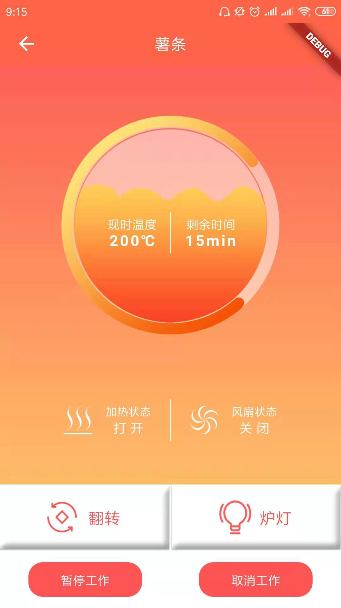

---
meta:
  - name: description
    content: 空气炸锅
  - name: keywords
    content: 空气炸锅
---

# 空气炸锅App介绍

凝卓智能科技 · 2019-07-22 14:00:00

### 操作说明

进入程序页面，主页面显示空气炸锅当前的温度、剩余时间、加热状态、风扇状态。

点击“翻转”按钮，启动或关闭旋转功能。点击“炉灯”按钮，打开或关闭炉灯。

点击“暂停工作”按钮，暂停当前工作，再次点击将会继续当前工作。点击“取消工作”按钮，取消当前工作，重置工作状态。
