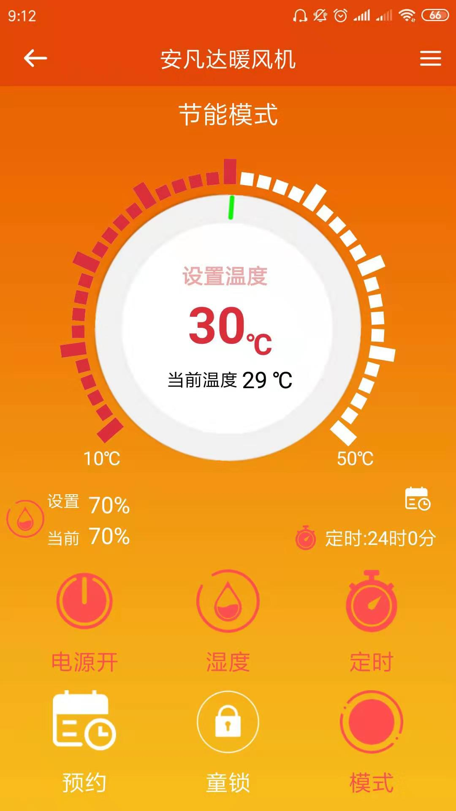
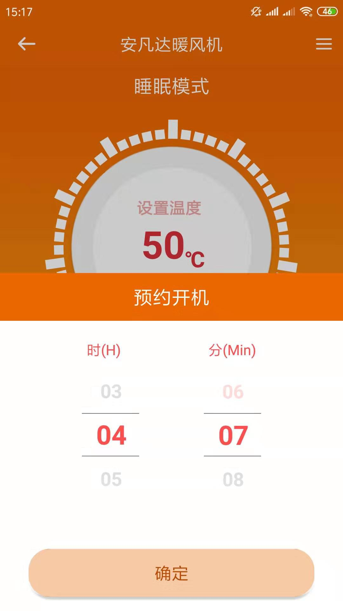
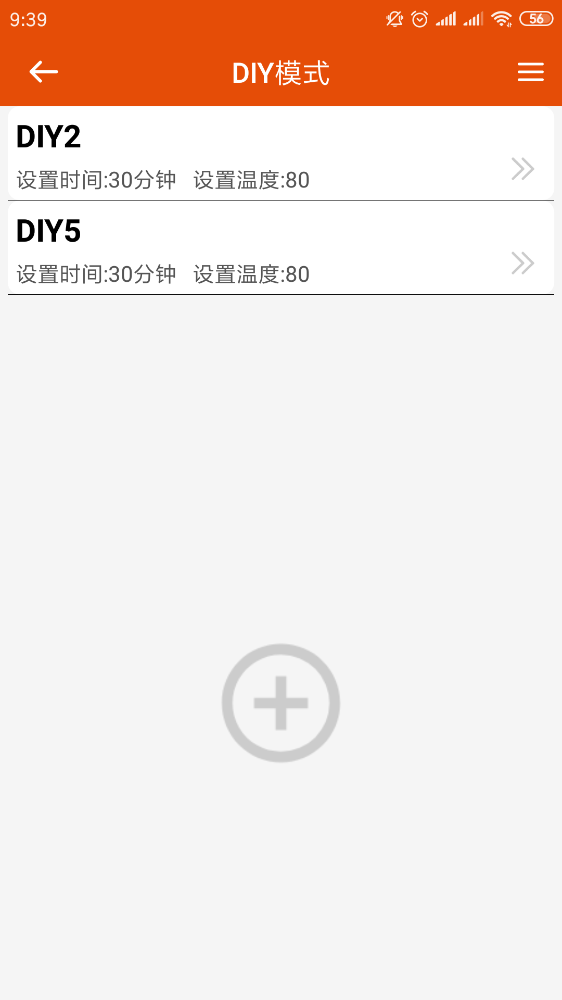

---
meta:
  - name: description
    content: 安凡达暖风机
  - name: keywords
    content: 安凡达暖风机
---

# 安凡达暖风机App介绍

凝卓智能科技 · 2019-07-22 14:00:00

### 操作说明

进入程序页面，主页面显示暖风机的当前温度、设置的温度、湿度、设置的湿度、定时时间。

当暖风机运行时，点击“电源开关”将会关闭暖风机，再次点击，暖风机将会重新开启。

程序中可设置“湿度”、“定时”、“预约”、“童锁”、“模式”

