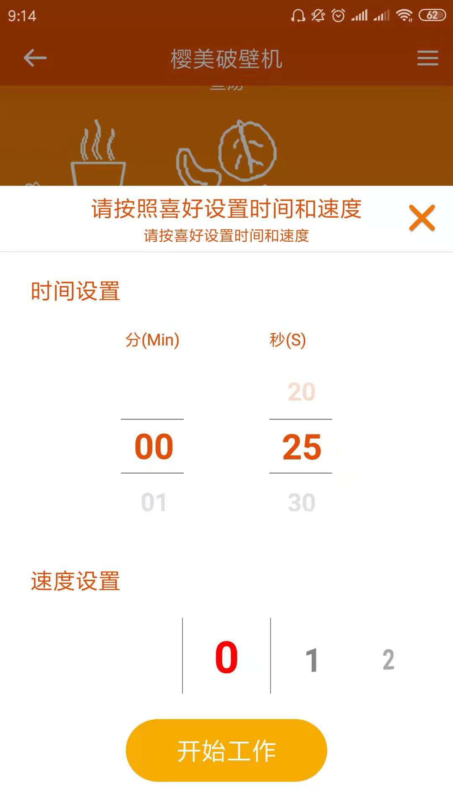

---
meta:
  - name: description
    content: 樱美破壁机
  - name: keywords
    content: 樱美破壁机
---

# 樱美破壁机App介绍

凝卓智能科技 · 2019-07-22 14:00:00

### 操作说明

进入程序页面，主页面显示破壁机多种不同的功能类型，当破壁机运行时，点击“电源开关”将会关闭破壁机，再次点击，破壁机将会重新开启。

选中其中一种类型，App将会弹出“时间设置”和“速度设置”页面，上下滑动“时间设置”的数字设置时间，左右滑动“速度设置”的数字设置速度。

设置完毕，点击“开始工作”按钮，破壁机将会开始工作。

