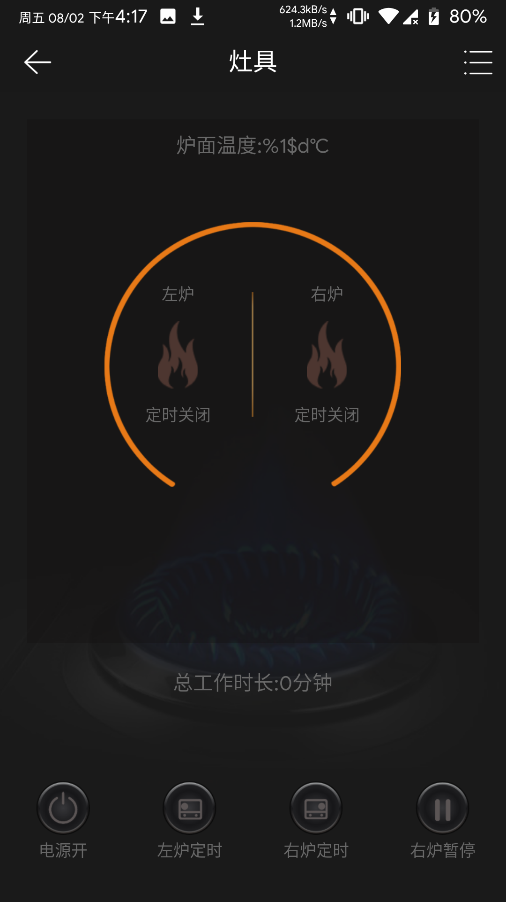
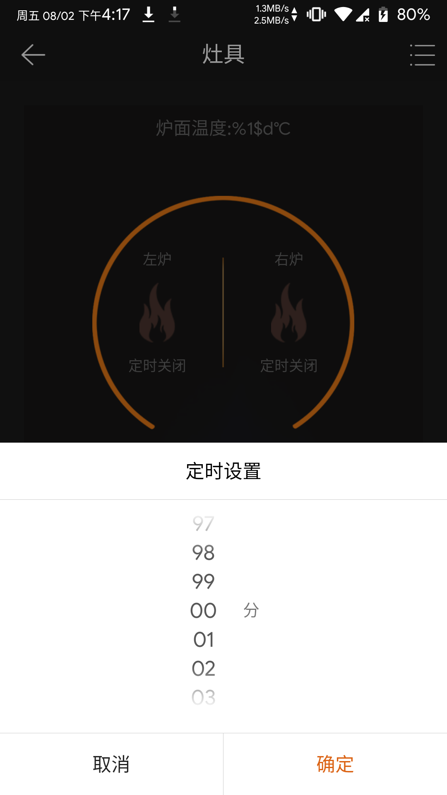

---
meta:
  - name: description
    content: 灶具
  - name: keywords
    content: 灶具
---

# 灶具App介绍

凝卓智能科技 · 2019-08-02 14:00:00

### 操作说明

进入程序页面，主页面显示“炉面温度”、“总工作时长”，程序可设置左炉和右炉的“定时开关”、“电源开关”，“左炉定时”、“右炉定时”、“右炉暂停”等功能

