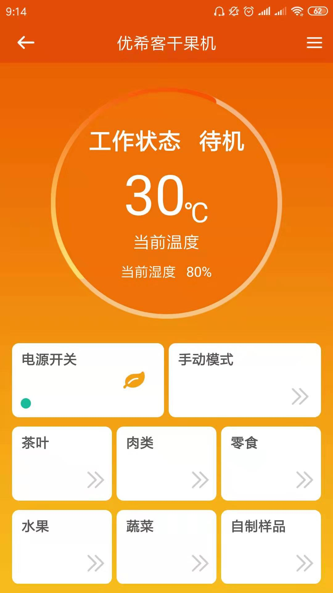

---
meta:
  - name: description
    content: 优希客干果机
  - name: keywords
    content: 优希客干果机
---

# 优希客干果机App介绍

凝卓智能科技 · 2019-07-22 14:00:00

### 操作说明

进入程序页面，当干果机运行时，点击“电源开关”将会关闭干果机，再次点击，干果机将会重新开启。

可选择“手动模式”，进入“DIY模式”自定义设置

从左往右，从上往下依次点击按钮，干果机将会分别进入“茶叶”、“肉类”、“零食”、“水果”、“蔬菜”、“自制样品”模式
