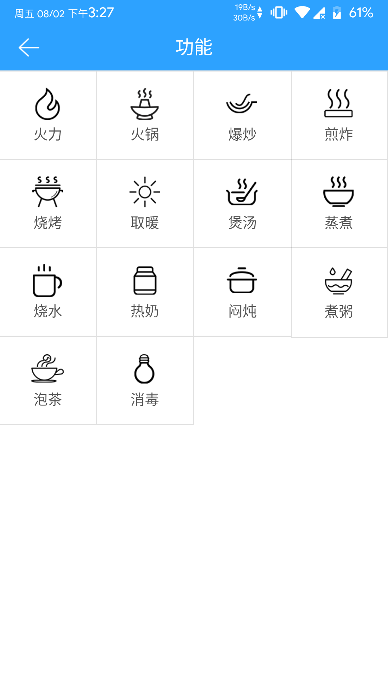

---
meta:
  - name: description
    content: 庄泽电陶炉
  - name: keywords
    content: 庄泽电陶炉
---

# 庄泽电陶炉App介绍

凝卓智能科技 · 2019-08-02 14:00:00

### 操作说明

进入程序页面，主页面显示庄泽电陶炉的“开关”和“功能”按钮，点击“功能”按钮跳转页面，在功能选择页面中可设置“火力”、“火锅”、“爆炒”、“煎炸”、“烧烤”、“取暖”、“煲汤”、“蒸煮”、“烧水”、“热奶”、“焖炖”、“煮粥”、“泡茶”、“消毒”等模式

