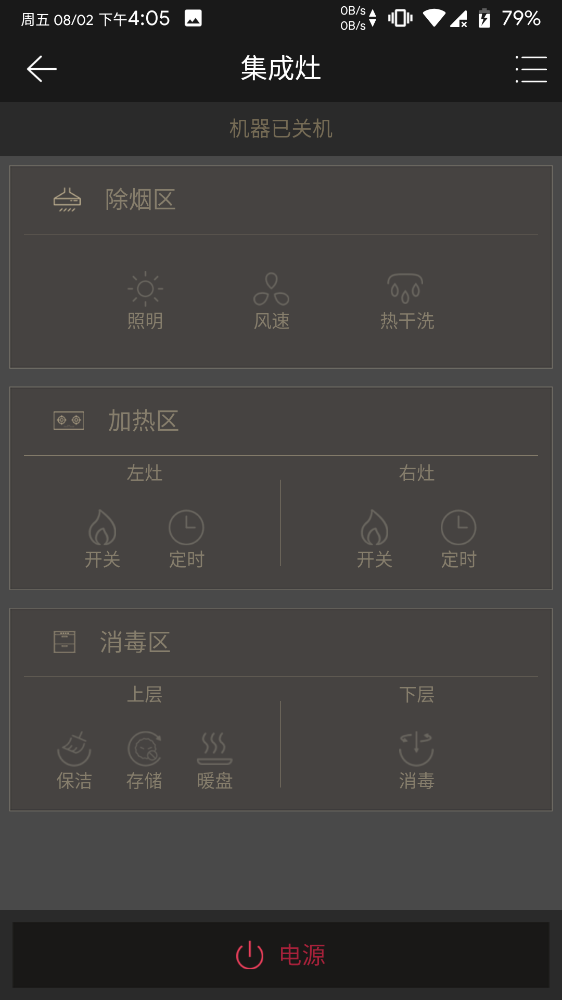

---
meta:
  - name: description
    content: 集成灶
  - name: keywords
    content: 集成灶
---

# 集成灶App介绍

凝卓智能科技 · 2019-08-02 14:00:00

### 操作说明

进入程序页面，程序可设置“电源开关”，除烟区的“照明”、“风速”、“热干洗”，加热区的左灶和右灶的“开关”、“定时”，消毒区的上层的“保洁”、“存储”、“暖盘”，下层的“消毒”等功能