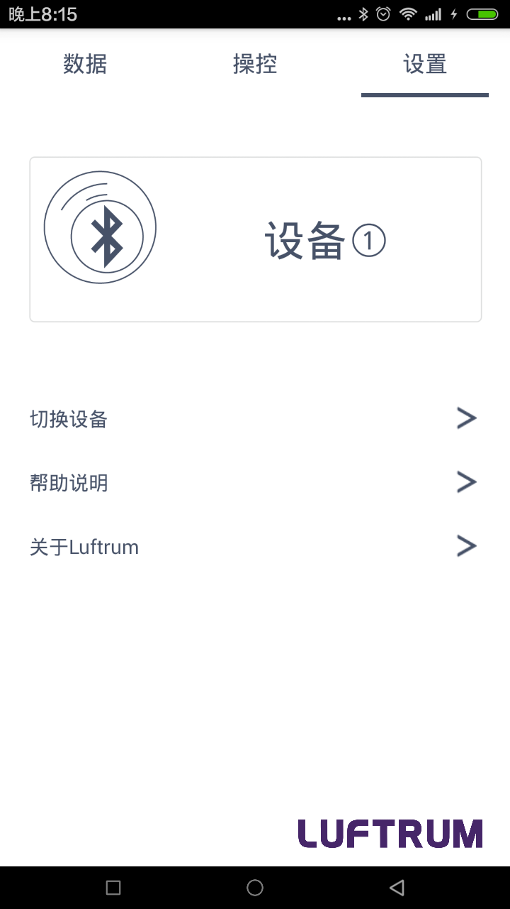
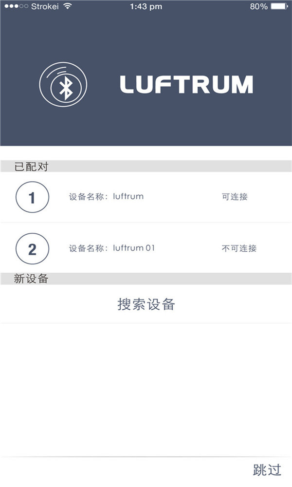
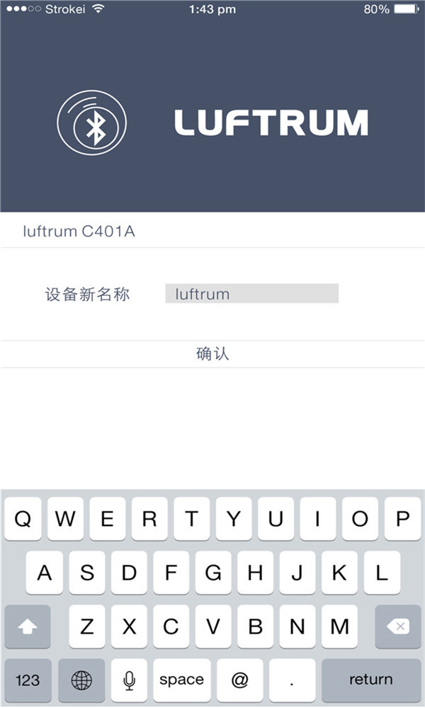

---
meta:
  - name: description
    content: luftrum车载空气净化器
  - name: keywords
    content: luftrum
---

# luftrum车载空气净化器小程序介绍

凝卓智能科技 · 2019-07-22 14:00:00

### 1、 如何搜索净化器

你需要先打开系统蓝牙，然后点击“搜索设备”（通过点击“设置”页面中的“切换设备”或“连接设备”的按钮进入"搜索设备"页面），软件即开始搜索净化器，新出现的名称中含有 “Luftrum” 字样的设备，即为本公司的空气净化器。

### 2、 如何更换设备名称

如果你的手机首次连接净化器，软件将自动进入设备名称设置界面

### 3、 如何控制净化器风速

进入“操控”页面如图4所示，当净化器运行时，点击  将会关闭净化器风机，再次点击  ，净化器将会进入”AUTO”档风速。当点击 “1”、“2”、“3” 时，净化器将会分别进入1档风速、2档风速、3档风速。当点击 “AUTO” 时，净化器将进入智能模式，风速会根据净化器传感器监测的数据改变。

### 4、 关于“滤网剩余时间”说明

净化器将会根据你的使用情况计算滤网的剩余时间并发送信息到手机端显示。

### 5、 如何连接另外一台净化器

点击“设置”页面所标示“切换设备”的按钮进入“蓝牙搜索”界面，即可连接已记录的净化器，或者搜索新的净化器再连接。

### 6、 监测空气质量等级说明

净化器内置了灰尘传感器，能准确监测空气PM2.5数值。软件将会实时显示净化器监测数据，并根据数据将空气质量分为3个等级的： PM2.5{{"<"}}35,空气质量优；35{{"≤"}}PM2.5{{"≤"}}75,空气质量良；PM2.5{{">"}}75,空气质量差。

### 7、 室外空气质量及天气状况说明

室外空气质量及天气状况信息均来源于网络提供商，该功能会获取你的地理信息。
