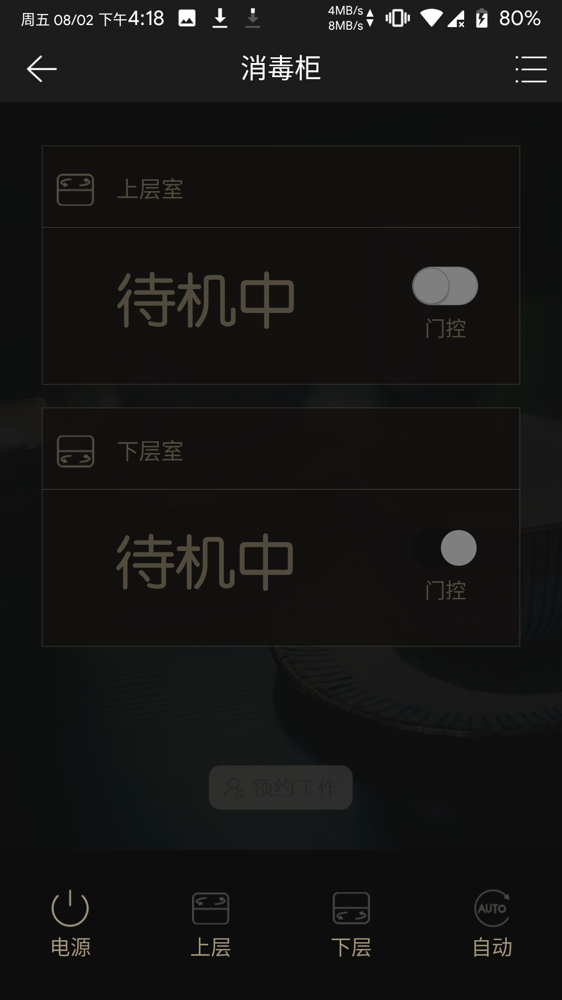
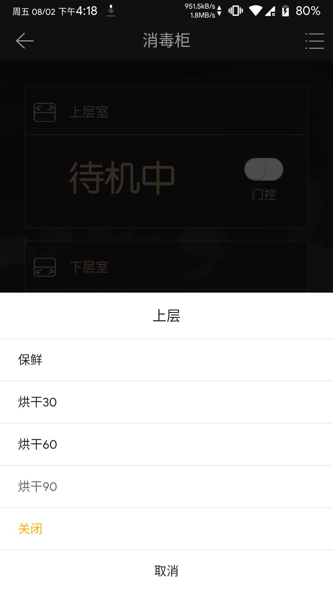
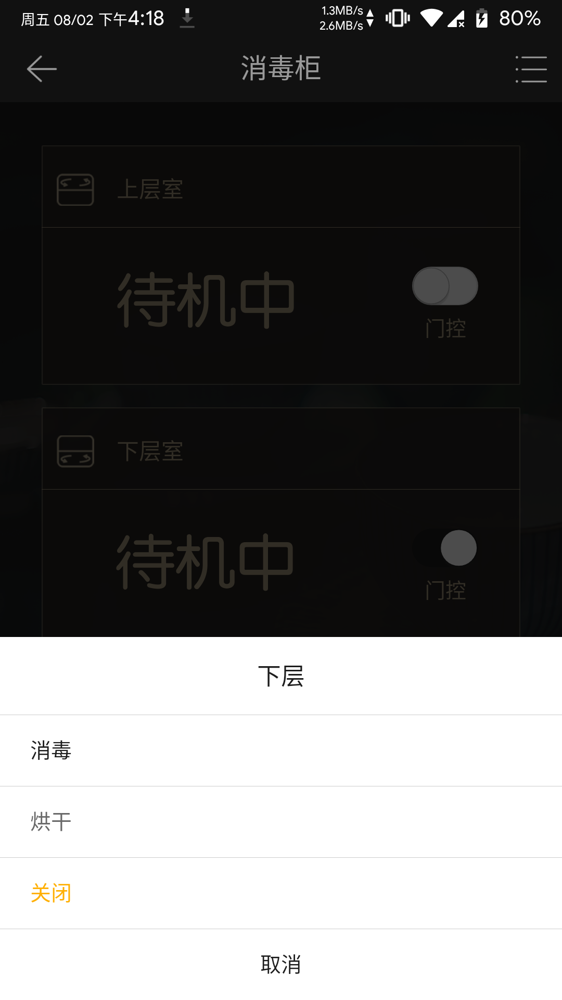

---
meta:
  - name: description
    content: 消毒柜
  - name: keywords
    content: 消毒柜
---

# 消毒柜App介绍

凝卓智能科技 · 2019-08-02 14:00:00

### 操作说明

进入程序页面，程序可设置上层室和下层室的“门控”、“电源开关”、“上层”（“保鲜”，“烘干30”、“烘干60”、“烘干90”、“关闭”）、“下层”（“消毒”、“烘干”、“关闭”）、“自动”等功能

